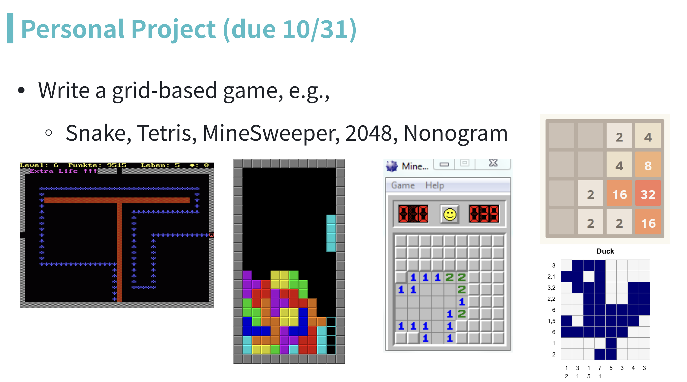

# 2D Grid Game

## Rules
- The project must be submitted by 2025/10/31 9pm.
- You can choose any games you would like, as long as it is a 2D grid.
- A graphic UI is not necessary. You can use the terminal for user interaction.
- Write a short doc (markdown) about your design and implementation (see [summary.md](./summary.md)). It should cover the top 3 design choices in your implementation. Feel free to record a gif on how to play.
